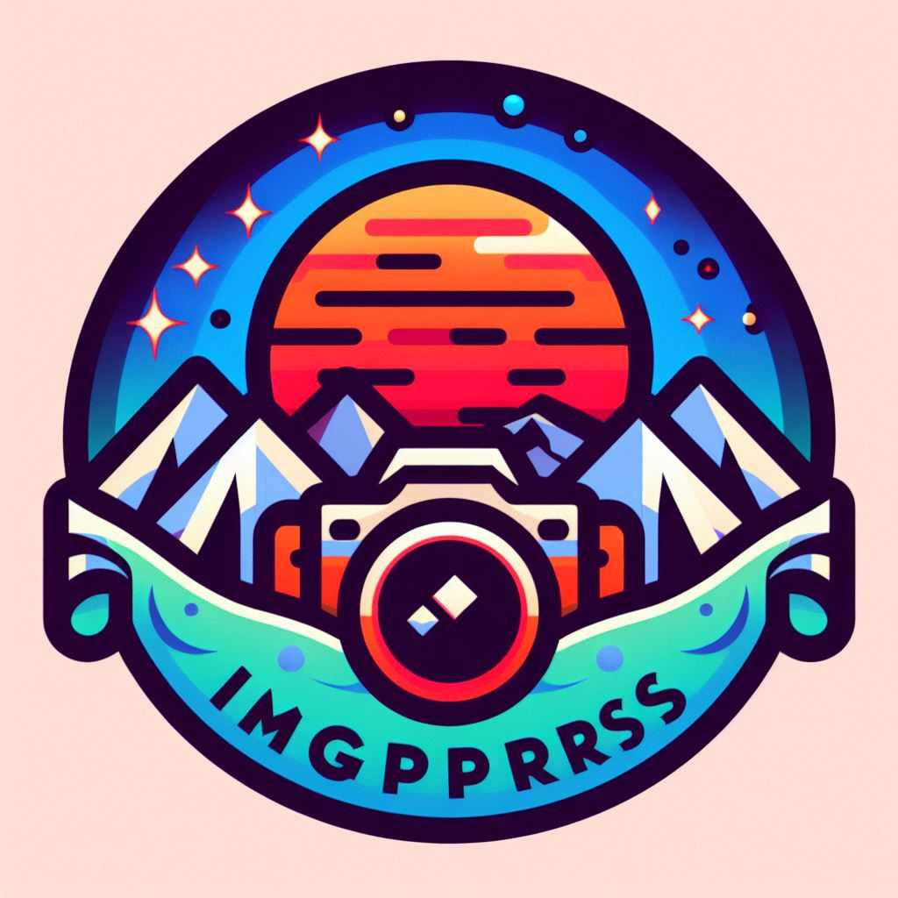

# ImgKmprssr

ImgKmprssr is your go-to image compression application that combines cutting-edge optimization and lossy compression algorithms. Shrink JPEG, GIF, and PNG images to the smallest possible size while maintaining the desired level of quality.

## Features

- Smart combination of optimization algorithms
- Lossy compression for minimal image size
- Support for JPEG, GIF, and PNG formats
- User-friendly interface for easy image compression
- Fast and efficient compression process

## Getting Started

1. Clone the repository: `git clone https://github.com/Kingkobi01/ImgKmprssr`
2. Install dependencies: `pip install -r requirements.txt`
3. Run the app: `python app.py`

## Usage

1. Open ImgKmprssr in your web browser.
2. Upload your images.
3. Experience the magic of compression.
4. Download the optimized images.

## Contributing

We welcome contributions! Feel free to open issues, submit pull requests, or provide feedback.

## License

This project is licensed under the [MIT License](LICENSE).

---

Feel the thrill of compressing images with ImgKmprssr! 🚀

## Demo

<video width="740" height="420" controls>

  <source src="./assets/ImgKmprssr.mp4" type="video/mp4">

  Your browser does not support the video tag.
</video>
